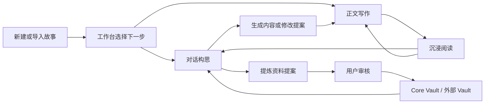

# Rhine-Lore APP 整体产品规划

版本：2026-08-14
定位：面向普通小说创作者的本地优先 AI 创作与阅读 APP

## 1. 产品定义

Rhine-Lore 不是 AI 控制台，也不是 Rhine-Vault 的管理前端。它首先是一款可以直接写、直接读、通过对话推进创作的小说 APP。

用户不需要理解模型、向量检索、后端进程或知识图谱。默认情况下，Lore 自动管理本地服务、模型降级策略和 Core Vault；只有需要跨设备、团队资料库或自建服务的用户，才进入高级设置连接外部 Vault。

### 核心承诺

1. 打开即可创建故事，未配置 AI 时仍可编辑、阅读和保存。
2. 对话结果可以进入正文，也可以经过确认后提炼为角色、设定、事实或伏笔。
3. 正文始终是用户可阅读、可编辑、可导出、可恢复的独立内容。
4. 数据默认留在本地，外部 AI 和外部 Vault 的连接状态始终可见。
5. 高级功能可以被发现，但不会阻挡第一次创作。

### 非目标

- 不把数据库表、检索参数或服务日志暴露给普通用户。
- 不要求用户先完成完整世界观和人物档案才能开始写。
- 不让 AI 自动批准永久事实；入库和正文修改必须可预览、可撤销。
- 不在首页堆叠所有编辑器和系统诊断入口。

## 2. 目标用户

| 用户 | 首要任务 | 默认体验 |
| --- | --- | --- |
| 第一次写小说的人 | 快速开始并得到下一步提示 | 模板、对话引导、自动保存、隐藏高级项 |
| 连载作者 | 稳定写章、查设定、保持一致性 | 项目工作台、正文编辑、资料引用、版本恢复 |
| 资料型创作者 | 管理角色、世界规则和长线伏笔 | 故事资料分组、可审核入库、关系与检索 |
| 本地化/自建用户 | 控制模型、Vault 和备份 | 高级设置、连接检测、外部 Vault、ZIP 迁移 |

## 3. 产品原则

- **任务优先**：导航名称使用“写正文、阅读、资料”等用户语言。
- **渐进披露**：第一次使用只出现创建、导入、对话和写正文；模型、Vault、演化参数在需要时展开。
- **项目即上下文**：顶栏始终显示当前项目；切换项目会同步切换对话、正文和资料范围。
- **建议不越权**：AI 先生成提案，再由用户应用到正文或批准入库。
- **阅读与编辑同源**：同一章节数据支持沉浸阅读、快速修订和完整编辑，不维护两份正文。
- **离线可退化**：AI 或外部 Vault 不可用时，基础创作链路仍成立。

## 4. 目标信息架构

### 全局框架

- **左侧栏**：模式切换、当前模式导航、后端状态。
- **顶栏**：当前项目、当前页面、保存状态、AI 状态；对话页使用自己的完整任务栏。
- **工作区**：一个页面只承担一种主要任务。
- **移动端**：侧栏变为抽屉，顶栏只保留菜单、页面标题和关键状态。

### 工作台模式

| 分组 | 页面 | 作用 |
| --- | --- | --- |
| 创作 | AI 对话、工作台、正文 | 高频入口，构成日常写作主路径 |
| 故事资料 | 故事档案、世界观、角色、地图 | 项目级结构资料，独立编辑 |
| 智能工具 | 资料库、演化 | 提炼、检索与实验性推演 |
| 系统 | 设置 | 连接、外观、备份和高级能力 |

### 阅读器模式

| 分组 | 页面 | 作用 |
| --- | --- | --- |
| 阅读 | 正文、小说阅读、书架 | 阅读自己的章节、演化连载和外部 TXT |
| 资料 | 资料库 | 阅读时查询设定或来源 |
| 系统 | 设置 | 阅读外观、连接与数据设置 |

### 首页工作台

首页是引导台，不是综合编辑器。首屏按以下顺序组织：

1. 当前故事摘要与“继续写作”主行动。
2. AI 对话入口。
3. 推荐创作路径，仅提示下一步。
4. 正文、阅读、书架、资料库四个快捷入口。
5. 横向故事卡片选择器。
6. 新建、导入和项目管理入口。

世界观、角色和故事档案只在独立页面编辑。首页可以显示完成度或缺失提示，但不直接放置复杂表单。

## 5. 四条核心闭环

### A. 零配置开始写

`打开 APP -> 新建故事 -> 输入一句想法 -> 创建项目 -> 写第一章`

- AI 未配置：提供结构模板和本地提示，不阻断编辑。
- AI 已连接：给出可跳过的开篇建议。
- 首次保存后显示“已保存在本机”，建立数据安全感。

### B. 对话转正文

`选择项目 -> 对话 -> 生成片段 -> 预览影响 -> 插入/替换/新建章节 -> 自动快照`

- 对话和正文调整是明确的模式切换。
- 应用前展示目标章节、影响范围和将要发生的修改。
- 应用后提供撤销或版本恢复入口。

### C. 对话提炼入资料库

`对话 -> 保存为资料 -> AI 拆分候选条目 -> 草稿 -> 送审 -> 批准入库 -> 后续对话引用`

- 候选类型包括角色、地点、规则、事件、事实、伏笔和参考资料。
- 默认只创建草稿，不自动形成永久事实。
- 每条资料保留来源对话、项目、时间和原文摘录。
- 冲突条目必须并排比较，允许覆盖、并存或暂不处理。

### D. 阅读中继续创作

`进入阅读 -> 目录/搜索/书签 -> 到达章末 -> 下一章/对话续写/编辑本章`

- 阅读设置包含主题、亮度、字体、字号、行距、段距、页宽、滚动/翻页和进度。
- 工具栏支持目录、全文搜索、书签、设置、全屏和编辑。
- 移动端点击区域、系统返回键、软键盘和安全区行为必须稳定。

## 6. Vault 产品边界

### 默认 Core Vault

1. Lore 启动时检查本地 Core Vault 健康状态。
2. 未运行时由 Lore 自动拉起，不要求用户操作进程。
3. UI 只显示“本地资料库：可用/启动中/需处理”。
4. 启动失败时先允许继续写作，再提供一键重试和可读错误说明。

### 外部 Vault

- 设置页支持填写 Vault Web/API 地址并测试连接。
- 外部 Vault 是可选的数据来源或目标，不替代 Lore 的项目正文存储。
- 切换 Vault 前展示工作区、权限和数据去向。
- 连接失败后自动回到 Core Vault，不丢失编辑内容。

### Vault Web

- Core 模式下提供“安装 Vault Web”入口，安装过程显示进度和失败恢复。
- 已安装后提供“打开 Vault Web”跳转，不在 Lore 内复制管理后台。
- 远程 Vault 已自带 Web 时直接打开其地址，不执行本地安装。

## 7. 页面职责

| 页面 | 主要任务 | 必须具备的完成状态 |
| --- | --- | --- |
| 工作台 | 选择故事并开始下一步 | 故事卡、继续写作、对话入口、新建/导入 |
| AI 对话 | 构思、续写、调整、提炼 | 全高会话、附件、项目上下文、提案确认、保存资料 |
| 正文 | 写章与修订 | 目录、编辑/阅读、自动保存、字数、版本、导出 |
| 故事档案 | 管理故事级元信息 | 名称、类型、概要、风格、状态 |
| 世界观 | 管理规则和地点 | 卡片浏览、抽屉编辑、标签、关联来源 |
| 角色 | 管理人物和关系 | 卡片浏览、抽屉编辑、关系、状态、秘密 |
| 地图 | 查看空间关系 | 全画布、地点、连接、缩放与聚焦 |
| 资料库 | 捕获、审核和检索 | 草稿、送审、批准、搜索、来源、冲突处理 |
| 演化 | 沙盘推演并生成章节 | 状态、回合、分支、有限视角、写入正文 |
| 小说阅读 | 阅读演化正文 | 标准阅读工具、章末继续、重写和引导 |
| 书架 | 导入并阅读 TXT | 拆章、进度、全文搜索、AI 续写、档案提取 |
| 设置 | 管理系统能力 | 基础设置默认展开，高级连接和维护折叠 |

## 8. 状态与反馈

所有写操作遵循同一状态模型：

`未修改 -> 正在保存 -> 已保存 -> 保存失败（可重试）`

所有外部能力遵循同一连接模型：

`检查中 -> 可用 -> 降级可用 -> 不可用`

- 顶栏只显示短状态，详细说明放在点击后的面板。
- 失败提示必须说明“发生了什么、内容是否安全、下一步能做什么”。
- 诊断日志只出现在设置的维护区域，不作为普通页面主内容。

## 9. 移动端规范

- 以 `360 x 740`、`390 x 844` 和常见 Android 安全区作为最低验收视口。
- 可点击区域不小于 40px，主行动不小于 44px 高。
- 单页只允许一个主要纵向滚动容器；抽屉和弹窗自行滚动。
- 软键盘弹出时，对话输入、发送和附件按钮保持可见。
- 侧栏抽屉打开后锁定背景滚动，系统返回键优先关闭抽屉/阅读浮层。
- 不依赖悬停说明关键功能，图标按钮同时提供可访问名称。

## 10. 视觉方向

视觉关键词：**机能、简约、安静、可靠、内容优先**。

- 深色侧栏作为稳定框架，内容区保持中性浅色/深色面板。
- 默认图标为单色线性图标，选中和主行动才使用蓝色。
- 状态色只用于成功、警告、错误和连接状态，不用于装饰性分类。
- 卡片半径以 6-8px 为主，减少悬浮感和大面积渐变。
- 品牌标识只用于产品识别；功能按钮不使用品牌图形替代通用符号。

详细图标规范见 [icon-system.md](./icon-system.md)。

## 11. 数据与安全

- 正文、项目资料和阅读进度由 Lore 持有；已批准知识由 Vault 持有。
- AI 修改前创建快照，恢复前再次备份当前状态。
- API Key 不进入项目导出包，不在日志和界面中回显完整值。
- ZIP 备份必须包含项目、章节、书架、版本记录和本地资料库数据。
- 导入先校验格式并生成预览，再允许合并或替换。

## 12. 分阶段实施

### P0：产品骨架与一致性

- 完成侧栏任务分组和机能简约图标系统。
- 统一保存、连接、空状态和错误反馈。
- 固化四条核心闭环的端到端测试。
- 明确 Core Vault 自动拉起、失败降级和状态文案。

### P1：创作闭环增强

- 对话提炼从“整段保存”升级为可编辑的结构化候选条目。
- 正文修改增加差异预览、目标选择和一键撤销。
- 首页根据项目状态提供单一“推荐下一步”。
- 资料冲突处理和来源追溯产品化。

### P2：高级能力

- Vault Web 安装、更新和跳转入口。
- 外部 Vault 多连接、工作区选择和权限提示。
- 跨设备备份/同步策略。
- 演化沙盘与正文、资料库之间的可控双向同步。

## 13. 验收指标

| 指标 | 目标 |
| --- | --- |
| 首次打开到创建项目 | 不超过 3 个主要操作 |
| 新项目到开始写第一章 | 不要求配置 AI 或 Vault |
| 对话内容写入正文 | 可预览目标，操作后可恢复 |
| 对话内容进入资料库 | 默认经过候选、草稿和确认 |
| 页面横向溢出 | 桌面和目标移动视口均为 0 |
| 图标一致性 | 无 Emoji/字符充当功能图标；统一 24px 网格与线宽 |
| 数据反馈 | 所有写操作均出现保存结果 |
| 离线能力 | 外部 AI/Vault 断开时仍可编辑、阅读和导出 |

## 14. 当前建议优先级

### 已完成

1. 机能简约图标迁移、侧栏任务分组和桌面/Android 视觉验收。
2. “保存对话为资料”升级为带来源的结构化候选提炼页。
3. Lore 内资料审核中心：草稿编辑、驳回、批量送审、批量入库、来源摘录和相似资料提示。
4. Core Vault 自动拉起、内置降级模式和外部 Vault 连接状态展示。
5. 对话正文修订预览、影响提示和版本恢复入口。
6. 相似资料“并存、合并、覆盖”决策，合并/覆盖形成可回滚的新 revision。
7. 资料来源跳回原对话或章节；来源缺失时保留摘录和可读降级提示。
8. Android 资料审核抽屉、滚动布局和系统返回键闭环验证。

### 下一步

1. 完善 Vault Web 安装、更新和跳转状态机。
2. 扩展多个外部 Vault 的连接档案、工作区映射和权限提示。
3. 为正式资料增加版本历史查看和一键回滚界面。
4. 设计跨设备备份与同步策略，再进入演化沙盘的双向资料同步。
